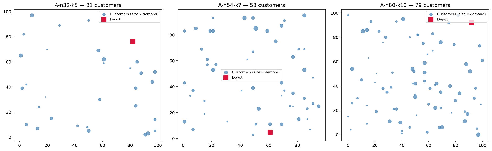
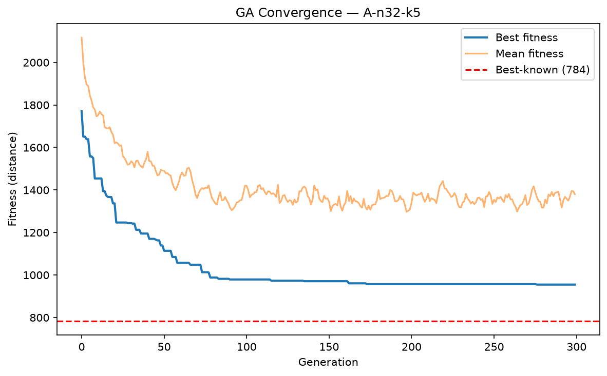
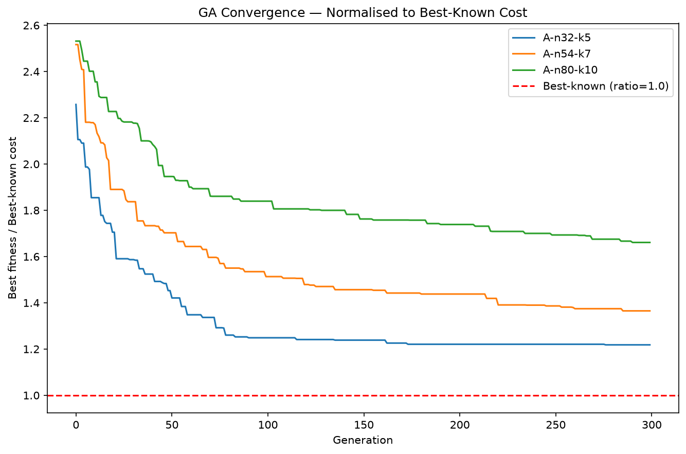
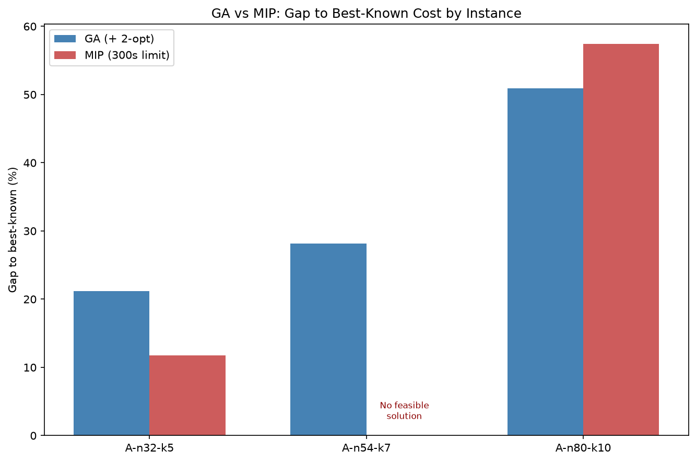

# Question 3: Optimization using Genetic Algorithms

## 3.1 Problem Definition and Literature Review

### 3.1.1 Problem Selection and Definition

The optimization problem selected for this study is the **Capacitated Vehicle Routing Problem (CVRP)**, one of the most extensively studied problems in combinatorial optimization and a core model in logistics, last-mile delivery, and supply chain planning.

In the CVRP, a fleet of *K* identical vehicles, each with capacity *Q*, is stationed at a single depot. A set of *n* customers must be served, each with a known location and a known, indivisible demand. Each vehicle departs from the depot, serves a subset of customers in sequence, and returns to the depot. The problem is to decide **which customers are assigned to which vehicle, and in what order each vehicle visits its assigned customers**, subject to the following requirements:

1. every customer is visited exactly once, by exactly one vehicle;
2. the total demand served on any single route does not exceed the vehicle capacity *Q*;
3. every route begins and ends at the depot;
4. exactly *K* vehicles are used, as specified by the problem instance.

The **optimization objective** is to minimise the total distance travelled across all routes. Distance is used as the cost measure because, for a homogeneous fleet, fuel, time, and driver cost are all approximately proportional to distance; this is also the convention used by the benchmark library from which the problem instances are drawn (Section 3.2).

Experiments are conducted on three instances of increasing size from the Augerat et al. Set A benchmark suite hosted on CVRPLIB [7] — A-n32-k5 (31 customers, 5 vehicles), A-n54-k7 (53 customers, 7 vehicles), and A-n80-k10 (79 customers, 10 vehicles) — each with a published best-known solution, enabling both solution quality and scalability to be assessed against ground truth (Sections 3.4–3.5).

### 3.1.2 Mathematical Formulation

The CVRP is formulated as a mixed-integer linear programme using the two-index vehicle flow formulation with Miller–Tucker–Zemlin (MTZ) subtour elimination constraints. This formulation is chosen because it is compact — the number of variables and constraints grows polynomially with instance size — and because it is the formulation implemented directly in the MIP solver in Section 3.4, keeping the mathematical model and the computational experiments consistent.

**Sets and parameters.** Let *V* = {0, 1, …, *n*} be the set of nodes, where node 0 is the depot and *V′* = {1, …, *n*} is the set of customers. For each ordered pair of nodes (*i*, *j*), *dij* denotes the Euclidean distance between them, computed from the instance coordinates and rounded to the nearest integer per CVRPLIB convention. Each customer *i* ∈ *V′* has demand *qi* > 0; each vehicle has capacity *Q*; and *K* is the fleet size fixed by the instance.

**Decision variables.**

$$x_{ij} \in \{0,1\} \qquad \forall\, i,j \in V,\; i \neq j$$

The binary variable *xij* equals 1 if a vehicle travels directly from node *i* to node *j*, and 0 otherwise. These are the integer (binary) decision variables required by the problem structure: routing decisions are inherently discrete, as an arc is either used or not.

$$u_i \in \mathbb{R} \qquad \forall\, i \in V'$$

The continuous auxiliary variable *ui* represents the cumulative load carried by a vehicle upon leaving customer *i*. It serves a dual purpose in the MTZ scheme: eliminating subtours and enforcing the capacity limit simultaneously.

**Objective function.**

$$\min \; \sum_{i \in V} \sum_{\substack{j \in V \\ j \neq i}} d_{ij}\, x_{ij}$$

The objective minimises the total distance of all arcs selected into the solution.

**Constraints.**

*(1) Indegree — each customer is entered exactly once:*

$$\sum_{\substack{i \in V \\ i \neq j}} x_{ij} = 1 \qquad \forall\, j \in V'$$

*(2) Outdegree — each customer is left exactly once:*

$$\sum_{\substack{j \in V \\ j \neq i}} x_{ij} = 1 \qquad \forall\, i \in V'$$

Constraints (1) and (2) are the equality constraints of the model. Together they guarantee that every customer lies on exactly one route and is visited exactly once.

*(3) Fleet size — exactly K vehicles depart from and return to the depot:*

$$\sum_{j \in V'} x_{0j} = K, \qquad \sum_{i \in V'} x_{i0} = K$$

*(4) MTZ subtour elimination and capacity (inequality constraints):*

$$u_j - u_i \;\geq\; q_j - Q\,(1 - x_{ij}) \qquad \forall\, i, j \in V',\; i \neq j$$

$$q_i \;\leq\; u_i \;\leq\; Q \qquad \forall\, i \in V'$$

The first family of inequalities activates only when arc (*i*, *j*) is used: if *xij* = 1 the big-*M* term vanishes and the load after customer *j* must exceed the load after customer *i* by at least *qj*, so loads accumulate monotonically along every route. If *xij* = 0 the constraint is slack and imposes nothing. The bounds *qi* ≤ *ui* ≤ *Q* then cap the accumulated load at vehicle capacity. Subtours — cycles among customers that never touch the depot — are rendered infeasible because a strictly increasing load cannot return to its starting value around a closed loop; routes through the depot remain feasible since the depot carries no *u* variable and the load effectively resets there.

**Problem classification and complexity.** The model is a mixed-integer linear programme: the objective and all constraints are linear, the *xij* are binary, and the *ui* are continuous. The CVRP is NP-hard, since it generalises the Travelling Salesman Problem (setting *K* = 1 and *Q* ≥ Σ*qi* recovers the TSP exactly). The scale of the search space is instructive even for the smallest instance studied here: A-n32-k5 admits 31! ≈ 8 × 10³³ orderings of its customers before route assignments are considered, while the MIP formulation contains roughly 992 binary variables for that instance alone. It is acknowledged that the MTZ formulation has a weaker linear relaxation than two-index formulations with exponentially many subtour elimination constraints, and is therefore not the formulation used by state-of-the-art exact solvers; it is adopted here for its compactness and implementability, which suit a controlled comparison at benchmark scale, and this trade-off is revisited in the scalability analysis of Section 3.4.

### 3.1.3 Literature Review

Research on the CVRP divides broadly into two methodological strands — exact optimization and (meta)heuristic search — with a third, more recent strand concerned with benchmarking and the empirical comparison of the two.

The exact strand begins, for the purposes of this study, with Augerat et al. [1], whose branch-and-cut algorithm for the CVRP established both an early computational milestone for integer-programming approaches and the benchmark instance sets (Sets A, B, and P) used in this work. Their approach strengthens the linear relaxation of the two-index formulation with problem-specific cutting planes, solving instances of up to several dozen customers to proven optimality — but at computational costs that grow steeply with instance size, foreshadowing the scalability limits examined in Section 3.4. Two decades of subsequent research culminated in the branch-cut-and-price algorithm of Pecin et al. [2], which combines column generation over route variables with advanced cutting planes and solves instances of up to 360 customers optimally — the current state of the art in exact CVRP solution. The sophistication required is instructive in itself: closing instances of a few hundred customers demands a purpose-built algorithm far beyond what a general-purpose MIP solver applied to a compact formulation can achieve, which frames realistic expectations for the off-the-shelf solver used in this study.

The metaheuristic strand is anchored by Prins [3], whose hybrid genetic algorithm was the first GA to outperform the then-dominant tabu search methods on the classical CVRP benchmarks. Two of its design ideas remain influential and are adopted in Section 3.3: a giant-tour chromosome that encodes a solution as a single permutation of customers without route delimiters, and an optimal splitting procedure that decodes the permutation into capacity-feasible routes — a decomposition that lets standard permutation crossover operators act on routing structure without producing infeasible offspring. The line of work descending from this design leads to Vidal [4], whose open-source hybrid genetic search (HGS) combines the giant-tour representation with aggressive local search and a diversity-preserving population, and constitutes the current state-of-the-art heuristic for the CVRP. Together, [3] and [4] document that evolutionary methods, when hybridised with problem knowledge, produce near-optimal CVRP solutions at a fraction of exact-method cost — the hypothesis this study tests at benchmark scale with a deliberately textbook GA.

The benchmarking strand connects the two. Uchoa et al. [5] survey the existing CVRP test sets — noting that the Augerat-era instances, while historically central, have become largely solvable by modern exact methods — and propose a new library of larger instances precisely because the frontier between "solvable exactly" and "requires heuristics" had moved. Their analysis of state-of-the-art exact and heuristic methods on the new instances makes the trade-off studied here explicit at the research frontier: exact methods provide certificates but hit a size wall, while heuristics scale but require empirical validation against known optima. Finally, on the applied side, Hoa et al. [6] deploy a GA-based CVRP model for a Vietnamese logistics company, illustrating the practical motivation for metaheuristics: real distribution problems demand good solutions within operational time budgets, under conditions where proving optimality carries little business value. 

Three observations from this literature shape the present study. First, the field's history is a sustained dialogue between exact and heuristic methods, with benchmarks such as [1] and [5] serving as the shared measuring stick — this study adopts the same protocol in miniature. Second, the strongest heuristics [3], [4] earn their performance through hybridisation with local search; a pure GA, as implemented here for pedagogical clarity, should therefore be expected to show a measurable gap to best-known solutions, and quantifying that gap is itself informative. Third, published comparisons typically pit state-of-the-art implementations against each other, whereas the practically relevant question for a non-specialist — how does an accessible, general-purpose MIP solver compare with a straightforward GA on modest instances? — is rarely addressed directly, and is the gap this study occupies.

### 3.1.4 Motivation for Selecting GA and MIP

The two solution methods compared in this study occupy opposite ends of the exactness–scalability spectrum, and it is precisely this opposition that makes their joint application to the CVRP informative.

**Mixed-Integer Programming** is the exact approach. The formulation of Section 3.1.2 is passed to a branch-and-bound solver, which either returns a provably optimal solution or, if terminated early, a feasible solution together with a bound quantifying the maximum possible optimality gap. This certificate of quality is the method's defining strength: no heuristic can provide it. Its weakness follows from the problem's NP-hardness — worst-case solution time grows exponentially with instance size, and the compact MTZ formulation in particular weakens as instances grow, so the method is expected to strain visibly across the three-instance ladder studied here. The exact-methods literature [1], [2] confirms this trajectory: pushing the size frontier requires increasingly specialised machinery, from problem-specific cutting planes to full branch-cut-and-price.

**Genetic Algorithms** represent the opposite trade-off. A GA maintains a population of candidate solutions encoded as chromosomes and improves them iteratively through selection, crossover, and mutation, guided only by a fitness function. It offers no optimality guarantee and no bound on solution quality; in exchange, its computational cost scales gracefully with instance size, it requires no algebraic model of the problem — only the ability to evaluate a candidate solution — and it accommodates complex or non-linear constraints that would break a linear formulation. For the CVRP, whose solutions are naturally encoded as permutations of customers, the GA also permits purpose-built operators that preserve solution structure — an approach validated by the strong track record of evolutionary methods on this problem [3], [4] and by their adoption in applied logistics settings [6] — examined in Section 3.3.

The motivation for applying both to the same benchmark instances is that their complementary failure modes make the comparison substantive rather than rhetorical. The known optimal solutions of the Augerat instances allow the GA's solution quality to be measured exactly, while the instance-size ladder exposes where the MIP's exactness stops being affordable. The comparison therefore addresses the practical question facing any practitioner with a routing problem: at what problem size, and under what requirements for solution guarantees, should one switch from exact optimization to metaheuristic search? This question is taken up empirically in Section 3.5.

---

## 3.2 Data Preparation and Problem Analysis

### 3.2.1 Dataset, Parameters, and Constraints

The problem data consists of three benchmark instances from the Augerat et al. Set A suite [1], originally hosted on CVRPLIB [7]. Because the `vrplib` package removed its download module after the CVRPLIB site relocated, the instance files were retrieved once from a public mirror of the canonical files, verified against the published parameters [7], and frozen in `data/raw/` — mirroring the download-once-and-snapshot discipline used in Questions 1 and 2. Each instance file specifies: the coordinates of one depot and *n* customers on a plane; an integer demand for each customer; a single vehicle capacity *Q*; and the fleet size *K*. The best-known solution cost for each instance is published in the instance file's comment field and serves as the ground truth against which both solvers are evaluated in Sections 3.4–3.5.

**Table 3.1 — Benchmark instance parameters**

| Instance | Customers (n) | Vehicles (K) | Capacity (Q) | Total demand | ⌈D/Q⌉ | Capacity utilisation | Demand min/mean/max | Best-known cost |
|---|---|---|---|---|---|---|---|---|
| A-n32-k5 | 31 | 5 | 100 | 410 | 5 | 82.0% | 1 / 13.2 / 24 | 784 (proven optimal) |
| A-n54-k7 | 53 | 7 | 100 | 669 | 7 | 95.6% | 2 / 12.6 / 36 | 1167 |
| A-n80-k10 | 79 | 10 | 100 | 942 | 10 | 94.2% | 1 / 11.9 / 26 | 1764 |

The parameters map directly onto the formulation of Section 3.1.2: coordinates generate the distance parameters *dij*, demands give *qi*, and *Q* and *K* enter the capacity and fleet-size constraints respectively. The three instances form a deliberate size ladder — 31, 53, and 79 customers — so that solution quality and computation time can be traced as instance size grows (Section 3.5). Capacity utilisation (total demand as a fraction of total fleet capacity) is reported because it measures constraint tightness, and Table 3.1 reveals a notable property: in all three instances the minimum feasible fleet size ⌈D/Q⌉ equals the specified *K*, so no solution can idle a vehicle, and every feasible solution must pack customers into exactly the minimum number of routes. Moreover, utilisation rises from 82.0% in the smallest instance to 95.6% and 94.2% in the larger two — the bigger instances are therefore harder on two compounding fronts, containing both more customers to sequence and markedly less slack capacity, so that the assignment of customers to vehicles approaches a tight bin-packing subproblem.

**Figure 3.1** — Spatial layout of the three instances: depot (red square) and customers (circles, area proportional to demand).

Figure 3.1 shows two structural features relevant to solution difficulty. First, in all three instances the depot is eccentrically placed — near the upper-right in A-n32-k5 and A-n80-k10, and on the lower boundary in A-n54-k7 — rather than centrally located, so every route incurs a substantial "stem" distance travelling to and from its service area, and routes must fan out across the plane rather than radiating evenly. Second, customers are dispersed approximately uniformly, with demand sizes interleaved spatially rather than clustered; there is no visually obvious partition of customers into *K* territories, so the assignment component of the problem must be discovered by the solver rather than read off the geometry. Consistent with the Set A design [1], [5], coordinates and demands are randomly generated, making these instances a test of general-purpose optimization rather than of exploiting special structure.

### 3.2.2 Problem Representations

Three representations are prepared from the raw instance files.

**Distance matrix.** For each instance, a full symmetric (*n*+1) × (*n*+1) matrix of pairwise Euclidean distances is computed from the coordinates and rounded to the nearest integer, following the CVRPLIB convention under which the published best-known costs are defined. Rounding is not cosmetic — results are only comparable to the benchmark literature if costs are computed under the same convention — and it requires an explicit step here: the instances declare the TSPLIB `EUC_2D` edge-weight type, which the `vrplib` reader interprets as unrounded double-precision distances, whereas the benchmark convention for these instances is nearest-integer rounding [5]. The self-computed rounded matrices were therefore verified element-for-element against the library's matrices after applying the same rounding — all three matched exactly, with symmetry and zero diagonals confirmed — guarding against a silent convention mismatch that would have distorted every downstream result. Matrices are persisted to `data/processed/` as NumPy arrays and serve both solvers: the GA fitness function evaluates route lengths by matrix lookup, and the MIP objective coefficients are read from the same matrix, guaranteeing that both methods optimise the identical cost surface.

**Demand vector.** Customer demands are held as an integer vector aligned with node indices (depot demand zero). It parameterises the capacity constraint in both solvers: as cumulative load bounds in the MIP's MTZ constraints, and as the feasibility rule of the route-splitting decoder in the GA (Section 3.3).

**Node indexing.** A single indexing convention — depot = 0, customers = 1…*n* — is fixed at load time and used unchanged across the distance matrix, demand vector, GA chromosome decoding, and MIP variable definitions, eliminating a common source of off-by-one errors between the two implementations.

No allocation or cost matrices beyond these are required: with a homogeneous fleet, cost is distance, and the customer-to-vehicle allocation is not an input but the decision output of the optimization itself.

### 3.2.3 Complexity Analysis

The CVRP's difficulty can be quantified from two directions. From the search-space side, a solution can be written as a permutation of customers (subsequently split into routes), so the raw solution space grows factorially: 31! ≈ 10³³·⁹ orderings for A-n32-k5, rising to 53! ≈ 10⁶⁹·⁶ for A-n54-k7 and 79! ≈ 10¹¹⁷·⁰ for A-n80-k10. Exhaustive enumeration is thus impossible at any of the three sizes; the question is only how intelligently each method navigates the space.

From the model side, the MIP formulation of Section 3.1.2 grows polynomially but steeply. The binary arc variables number (*n*+1)·*n* — 992, 2,862, and 6,320 across the three instances — while the MTZ inequality constraints scale as *n*(*n*−1): 930, 2,756, and 6,162 respectively, alongside 31, 53, and 79 continuous load variables. Polynomial model growth is deceptive, however: solution time for branch-and-bound is governed not by the model's size but by the exponential worst case of the search tree over the binary variables, compounded by the known weakness of the MTZ linear relaxation. The practical consequence — tractable at n = 31, strained at n = 53, and likely intractable within a reasonable time budget at n = 79 — is tested empirically in Section 3.4.

The constraint structure adds a final layer of difficulty beyond size alone. The capacity constraint couples the assignment subproblem (which customers share a vehicle) with the sequencing subproblem (the order within each route), so the CVRP cannot be decomposed into independent TSPs without losing optimality; and where capacity utilisation is high, feasible solutions themselves become sparse in the search space, penalising methods that explore infeasible regions.

### 3.2.4 Preprocessing Steps and Assumptions

Preprocessing is deliberately minimal, and each step is stated with its rationale. The instances are downloaded once and frozen; distances are computed and rounded as described in Section 3.2.2; and no scaling, imputation, or outlier treatment applies, since the data are exact problem parameters rather than noisy measurements — a categorical difference from the data preparation of Questions 1 and 2.

The modelling assumptions, largely inherited from the CVRP's standard definition, are: (i) the fleet is homogeneous, with a single shared capacity *Q*; (ii) travel cost is symmetric Euclidean distance, with no travel-time, time-window, or road-network considerations; (iii) each customer's demand is indivisible and served by exactly one visit (no split deliveries); (iv) exactly *K* vehicles are used, as fixed by the benchmark instance and assumed by its best-known solution; and (v) all parameters are deterministic and known in advance. Assumptions (i)–(iii) and (v) define the classical CVRP and keep results comparable to the published literature [1], [5]; relaxing them yields the richer VRP variants surveyed in [5] and is beyond this study's scope.

## 3.3 Genetic Algorithm Design and Implementation

### 3.3.1 Chromosome Representation and Decoding

Following the design of Prins [3], a candidate solution is encoded as a **giant tour**: a single permutation of the *n* customers, with no explicit markers indicating where one vehicle's route ends and the next begins. The permutation contains no depot visits and no route delimiters.

This representation is chosen specifically to decouple the combinatorial search from constraint feasibility. A chromosome that directly encoded routes (e.g. via delimiter genes) would produce capacity-infeasible offspring under almost any standard crossover, since crossing over route boundaries at arbitrary points has no reason to preserve capacity limits — requiring repair heuristics that add complexity and bias. Under the giant-tour representation, by contrast, *any* permutation of customers is a syntactically valid chromosome; feasibility is instead guaranteed by the decoding procedure.

**Split decoding.** A greedy split procedure converts a giant tour into a set of capacity-feasible routes: the tour is scanned left to right, accumulating customers onto the current route until adding the next customer would exceed capacity *Q*, at which point the current route is closed and a new one starts with that customer. Each closed route is then costed as depot → customers → depot using the verified distance matrices of Section 3.2. Because the decoder never adds a customer that would breach capacity, **every decoded solution is capacity-feasible by construction** — the GA never wastes evaluations on capacity-infeasible candidates, and constraint (4) of the mathematical formulation (Section 3.1.2) is satisfied automatically rather than searched for. As a concrete check, decoding the trivial (unoptimised) customer ordering 1, 2, …, 31 on A-n32-k5 produced five routes of lengths [7, 7, 6, 7, 4] — summing correctly to all 31 customers — at a total distance of 2082, against a best-known cost of 784; the gap is expected, since this ordering carries no routing intelligence, but it confirms the decoder produces a complete, correctly structured solution from an arbitrary permutation.

**Handling the fixed fleet size.** The benchmark instances specify an exact fleet size *K* (Table 3.1), but the greedy decoder has no mechanism to target a specific number of routes — it produces however many routes capacity dictates. Two designs were considered: modifying the decoder to force exactly *K* routes (e.g. via dynamic-programming split, as in [3]), or treating route count as a **soft constraint** via a fitness penalty. The soft-constraint approach is adopted here for its simplicity and transparency, at the cost of occasionally exploring solutions that use slightly more or fewer routes than specified before the GA converges on a genuinely K-route solution; this trade-off is made explicit in Section 3.3.2 below.

### 3.3.2 Fitness Function

Fitness is defined as total route distance plus a penalty for deviating from the target fleet size:

$$\text{fitness}(\text{chromosome}) = \sum_{\text{routes}} \text{distance}(\text{route}) \;+\; \lambda \cdot |{\text{routes used}} - K|$$

with penalty weight λ = 1000. This weight is chosen to be large relative to typical route lengths (on the order of 150–400 for these instances), so that any solution using the wrong number of routes is dominated by any solution using exactly *K*, regardless of distance — the GA is thereby steered to treat the fleet-size constraint as effectively hard, while retaining the flexibility of exploring the surrounding search space during evolution.

**Empirical necessity of the penalty.** Whether this penalty term is active in practice depends on the instance's capacity utilisation (Table 3.1). Testing the fitness function across 100 randomly generated permutations per instance shows a clear pattern: on A-n32-k5 (82.0% utilisation), all 100 random individuals decoded to exactly 5 routes, matching *K* exactly, so the penalty was never triggered. On the two tighter instances, by contrast, the penalty is materially active: only 16/100 random individuals on A-n54-k7 (95.6% utilisation) and 25/100 on A-n80-k10 (94.2% utilisation) decoded to exactly *K* routes, with the remainder consistently using one route more than *K* (route counts never fell below *K*, since using fewer routes than the capacity-driven minimum is impossible under the greedy decoder). This confirms that the penalty's importance is not uniform but scales with constraint tightness — precisely the property identified for these instances in Section 3.2.1 — and demonstrates that the penalty term is a functional necessity for the two larger instances rather than a redundant safeguard.

**Table 3.2 — Initial random population characteristics (100 individuals, seed 42)**

| Instance | Capacity utilisation | Route count (min/mean/max) | Individuals at exactly K | Fitness (min/mean) |
|---|---|---|---|---|
| A-n32-k5 | 82.0% | 5 / 5.00 / 5 | 100/100 | 1770 / 2117.3 |
| A-n54-k7 | 95.6% | 7 / 7.84 / 8 | 16/100 | 2917 / 4113.5 |
| A-n80-k10 | 94.2% | 10 / 10.75 / 11 | 25/100 | 4565 / 5716.6 |

Comparing the minimum initial-population fitness to the best-known costs (Table 3.1) gives a first sense of the optimisation gap the GA must close: 1770 versus 784 (2.26×) on A-n32-k5, 2917 versus 1167 (2.50×) on A-n54-k7, and 4565 versus 1764 (2.59×) on A-n80-k10, for entirely unoptimised random orderings. Closing this gap through selection, crossover, and mutation is the subject of the remainder of Section 3.3.

### 3.3.3 Selection and Crossover Operators

**Selection.** Parents are chosen by **tournament selection**: a fixed number of individuals (tournament size = 5) are sampled uniformly at random from the population, and the fittest among them — lowest fitness, since the objective is minimisation — is selected as a parent. Tournament selection is preferred over roulette-wheel selection here because it is invariant to the absolute scale of fitness values; roulette-wheel selection would be distorted by the penalty term of Section 3.3.2, which can add a large constant to fitness values without changing relative ranking, whereas tournament selection depends only on ordinal comparisons.

Selection pressure was verified empirically on the A-n32-k5 initial population (fitness range 1770–2454, mean 2117.3): over 1000 repeated tournament selections, the mean fitness of selected individuals was 1964.0 — roughly 7.2% below the population mean — confirming the operator consistently favours fitter individuals without collapsing diversity in a single step.

**Crossover: Order Crossover (OX).** Two parent permutations produce a child by copying a contiguous, randomly chosen slice from the first parent directly into the child, then filling the remaining positions with the second parent's genes, taken in their original relative order and skipping any gene already copied from the first parent. OX is the standard crossover for permutation-based chromosomes [3], [4] because it always produces a valid permutation — no gene is duplicated or omitted — requiring no repair step, which matters given that the giant-tour representation's entire purpose (Section 3.3.1) is to keep chromosome validity separate from constraint feasibility.

Applying OX to two individuals from the initial population confirmed both resulting children were valid permutations of all 31 customers, with fitness values (2169 and 2157) falling near the parents' range (2366 and 2054) — consistent with a single crossover application performing recombination without yet being subject to the selection pressure that drives improvement across generations.

### 3.3.4 Mutation Operator

Mutation is applied with two interchangeable moves, chosen stochastically per call: **swap mutation**, which exchanges the customers at two randomly chosen positions, and **inversion mutation**, which reverses a randomly chosen contiguous segment of the chromosome. Both moves preserve permutation validity by construction — swap only reorders two existing genes, and reversing a segment cannot introduce or remove any element — so, consistent with the crossover operator, no repair step is required. Inversion mutation is included alongside the simpler swap because it can restructure a larger portion of the route sequence in one step, helping escape local optima that a single-swap neighbourhood cannot reach, while swap mutation provides finer-grained, lower-disruption exploration.

A sanity check on A-n32-k5 confirmed the mutation operator preserves permutation validity, and a representative call — which happened to invoke the swap move — changed exactly two chromosome positions (13 and 20), moving fitness from 2366 to 2337. This modest, localised change is the expected signature of swap mutation, in contrast to inversion mutation, which would be expected to alter a contiguous block of positions rather than two isolated ones.

### 3.3.5 Elitism and the Full Generation Step

A single generation combines the preceding operators as follows: the fittest **elite_count = 2** individuals are copied unchanged into the next generation, guaranteeing the best solution found so far is never lost to the randomness of selection, crossover, or mutation; the remaining population is filled by repeatedly selecting two parents by tournament, applying OX crossover with probability 0.8 (otherwise copying the first parent), and applying mutation to the result.

Running one full generation on the A-n32-k5 initial population confirmed the design works as intended: best fitness improved from 1770 to 1728 and, more tellingly, the population mean fell from 2117.3 to 2012.5 in a single step — evidence that the population as a whole, not merely its best member, is converging. All offspring remained valid permutations, and the elite-preservation guarantee held (best fitness did not regress). These checks — validity, elitism, and directional improvement — are the minimum bar a generation step must clear before being trusted to run unattended across many generations, which is the subject of Section 3.3.7.

### 3.3.6 Hyperparameter Tuning

Before committing to a configuration for the full multi-instance runs, the GA's four principal hyperparameters — population size, crossover probability, mutation probability, and number of generations — were tuned via a one-factor-at-a-time sensitivity analysis on A-n32-k5, varying each parameter around a baseline of population = 100, crossover rate = 0.8, mutation rate = 0.5, generations = 300 (seed fixed at 42 throughout for comparability).

**Table 3.2b — Hyperparameter sensitivity analysis (A-n32-k5)**

| Parameter varied | Value | Final fitness | Gap to best-known |
|---|---|---|---|
| Population size | 50 | 902 | 15.05% |
| Population size | **100 (baseline)** | 955 | 21.81% |
| Population size | 150 | 889 | 13.39% |
| Crossover rate | 0.60 | **868** | **10.71%** |
| Crossover rate | 0.80 (baseline) | 955 | 21.81% |
| Crossover rate | 0.95 | 878 | 11.99% |
| Mutation rate | 0.20 | 869 | 10.84% |
| Mutation rate | 0.50 (baseline) | 955 | 21.81% |
| Mutation rate | 0.80 | 894 | 14.03% |
| Generations | 100 | 979 | 24.87% |
| Generations | 200 | 957 | 22.07% |
| Generations | 300 (baseline) | 955 | 21.81% |

Two patterns emerge. First, **number of generations behaves exactly as expected**: performance improves monotonically from 100 to 300 generations, with clearly diminishing returns (24.87% → 22.07% → 21.81%), consistent with the plateauing convergence curve already observed in Figure 3.2. This is the one hyperparameter whose effect is unambiguous and predictable.

Second, and more striking, **the baseline configuration was the single worst-performing setting in every other sweep**: for population size, crossover rate, and mutation rate alike, both the lower and higher alternative tested outperformed the baseline value, in some cases substantially — crossover rate 0.6 nearly halved the gap relative to the baseline (10.71% versus 21.81%). The best individual configuration found, crossover rate = 0.6 with all other parameters at baseline, reduced the final gap from 21.81% to 10.71%, a result that would have brought the GA's A-n32-k5 performance close to parity with the MIP solver's 11.73% (Table 3.4) at a fraction of the computational cost.

This result should be read with an important caveat: each configuration was evaluated with a **single run at a fixed seed**, since a full multi-seed statistical comparison across all twelve configurations was not feasible within the project timeline. Genetic algorithms are stochastic, and a single run's outcome reflects both the hyperparameter setting and that run's particular sequence of random draws; the consistent pattern of the baseline underperforming its alternatives across three independent sweeps is suggestive rather than statistically conclusive, and a rigorous tuning exercise would repeat each configuration across multiple seeds and compare means and variances. Given this, the tuning result is reported here as a directional finding — crossover rate in particular appears to matter more than intuition would suggest, and a value of 0.8 was not obviously the right default — rather than as a definitively optimal configuration. The multi-instance results in Section 3.3.8 retain the original baseline configuration for consistency with earlier verified cells, with this tuning analysis flagged as the natural next step were further time available.

### 3.3.7 GA Execution and Convergence — A-n32-k5

The full GA (population 100, tournament size 5, crossover rate 0.8, mutation rate 0.5, elitism count 2, seed 42, 300 generations) was run on the smallest instance first, to validate behaviour before committing to the larger two. Convergence is shown in Figure 3.2.

**Figure 3.2 — GA convergence on A-n32-k5**

Best fitness fell steeply from 1770 to approximately 970 by generation 80, then flattened almost completely, reaching a final value of 955 by generation 300 — a **21.81% gap** to the proven-optimal 784. Mean fitness followed a similar early decline but then plateaued into a noisy stationary band around 1300–1400 without tracking the best individual downward, indicating the population lost effective diversity well before generation 100 while the elite solution itself became stuck.

To test whether this plateau stemmed from locally inefficient routes (e.g. crossing paths within a route, correctable by local search) or from a fundamentally suboptimal grouping of customers into routes, **2-opt local search** was applied as a post-processing step to the GA's final best solution, following the local-search hybridisation approach of Prins [3] and Vidal [4]. The result was informative: 2-opt reduced distance by only 5 units (955 → 950, 0.52%), narrowing the gap to 21.17%. This small effect indicates that the routes discovered by the GA were **already close to locally 2-opt-optimal individually** — the plateau is not primarily a route-geometry problem. The bottleneck instead lies in the **customer-to-route assignment**: swap and inversion mutation, combined with OX crossover, are effective at reordering customers *within* a given grouping but comparatively weak at discovering materially different groupings, since a single swap or segment reversal rarely reassigns a customer to a different vehicle's route under the greedy split decoder. This is reported as an honest empirical limitation of the pure-GA design implemented here, consistent with the literature's observation that state-of-the-art GA performance depends on hybridisation with more powerful local search embedded throughout the search, not applied once at the end [3], [4]. A brief post-hoc 2-opt pass is retained as a low-cost final refinement in the results reported henceforth, while the underlying assignment-exploration limitation is carried forward as a discussion point in Section 3.5.

### 3.3.8 GA Results Across All Instances

The identical GA configuration (population 100, 300 generations, tournament size 5, crossover rate 0.8, mutation rate 0.5, elitism count 2, seed 42, final 2-opt polish) was applied unchanged to all three instances, to isolate the effect of instance size rather than confound it with per-instance tuning.

**Table 3.3 — GA results summary**

| Instance | GA distance (raw) | After 2-opt | Best-known | Gap to optimum | Routes used / K | Wall-clock time (300 gens) |
|---|---|---|---|---|---|---|
| A-n32-k5 | 955 | 950 | 784 | 21.17% | 5/5 | 0.81s |
| A-n54-k7 | 1593 | 1496 | 1167 | 28.19% | 7/7 | 1.05s |
| A-n80-k10 | 2930 | 2662 | 1764 | 50.91% | 10/10 | 1.36s |

**Figure 3.3 — GA convergence across all three instances, normalised to each instance's best-known cost**

Two results stand out. First, **the fleet-size constraint was satisfied exactly in every run** — all three instances converged to solutions using precisely *K* routes, despite the split decoder having no explicit mechanism to target *K* and relying entirely on the soft penalty of Section 3.3.2. This confirms the penalty design was sufficient in practice: with λ = 1000 dominating any plausible distance difference, the GA reliably eliminated the wrong-route-count solutions that Section 3.3.2 showed were common (up to 84% of the initial random population on the tighter instances) well before convergence.

Second, and more consequentially, **the optimality gap degrades sharply with instance size** — from 21.17% at *n* = 31 to 50.91% at *n* = 79, more than doubling despite the instance size only growing by a factor of 2.5. Figure 3.3 shows this is not merely a difference in starting point (all three instances begin in a broadly similar normalised range, 2.1–2.5× best-known) but a difference in how far each is able to descend: A-n32-k5 converges to roughly 1.2× best-known, while A-n80-k10 plateaus around 1.65×. This pattern is consistent with, and directly explained by, the search-space analysis of Section 3.2.3: the permutation space grows factorially (from 10³³·⁹ orderings at *n* = 31 to 10¹¹⁷·⁰ at *n* = 79) while the GA was run with an **identical, fixed computational budget** — the same population size and generation count regardless of instance size. A fixed budget necessarily explores a shrinking fraction of an exponentially growing space, so the degrading gap is the expected signature of under-resourced search on larger instances rather than a flaw specific to any one operator. This observation directly foreshadows the scalability comparison against the MIP solver in Sections 3.4–3.5, where the same three-instance ladder is used to test whether an exact method degrades in the same way, differently, or not at all.

### 3.3.9 Computational Efficiency

The full 300-generation GA run completed in well under two seconds on every instance tested — 0.81s for A-n32-k5, 1.05s for A-n54-k7, and 1.36s for A-n80-k10 — corresponding to an average per-generation cost of 2.7ms, 3.5ms, and 4.5ms respectively. Per-generation cost grows only mildly with instance size, roughly in line with the linear-to-quadratic cost of decoding and evaluating each individual's chromosome (Section 3.3.1) rather than anything approaching the factorial growth of the underlying search space; this is precisely why a fixed generation count explores a shrinking *proportion* of the space as instances grow (Section 3.3.8) even though the *absolute* per-generation cost barely changes.

The contrast with the MIP solver's computational profile (Section 3.4) is stark: the GA's total runtime across all three instances combined (3.22 seconds) is a small fraction of a single second of the 300-second budget CBC consumed on *each individual* MIP run — a difference of roughly two to three orders of magnitude. This asymmetry underlines the distinction drawn in Section 3.5.2: the GA's runtime is governed by a deliberate, tunable stopping criterion (generation count) that could be reduced further with only a graceful loss in solution quality (Table 3.2b shows the gap only worsens from 21.81% to 24.87% when generations are cut from 300 to 100 — a real but modest cost for a roughly 3× runtime saving), whereas the MIP solver's 300-second runtime is not a design choice at all but the full extent of the budget allotted, consumed entirely on every instance with no indication any of the three runs was near convergence.

## 3.4 Mixed Integer Programming (MIP) Formulation and Implementation

### 3.4.1 Implementation and Correctness Verification

The mathematical model of Section 3.1.2 — the two-index MTZ formulation — was implemented directly in PuLP against the CBC solver bundled with the package. Before solving anything, the model's structural correctness was verified against the complexity analysis of Section 3.2.3: for A-n32-k5, the constructed model contained exactly 1,023 variables (992 binary *xij* plus 31 continuous *ui*) and 994 constraints (31 indegree + 31 outdegree + 2 fleet-size + 930 MTZ), matching the predicted counts exactly. This confirms the implementation is a faithful, error-free translation of the formulation rather than an approximation of it.

A time limit of 300 seconds per instance was imposed on the solver, both to keep total experiment time tractable across three instances and, more importantly, because it is standard practice for MIP solvers applied to NP-hard problems: a hard budget forces an explicit, reportable choice between proven optimality and a time-limited feasible solution with a quantified bound, rather than an open-ended run.

**A methodological caveat, discovered empirically and worth stating plainly:** PuLP's own solver-status field (`LpStatus`) reported `"Optimal"` for every run in this study, *including runs that CBC's own log explicitly recorded as `"Stopped on time limit"`*. This is a known limitation of PuLP's status mapping — it reflects that a solution was returned, not that optimality was proven. Consequently, this study parses CBC's raw solver log directly, reading its explicit `"Stopped on time limit"` message alongside its own reported lower bound and optimality gap, rather than trusting the PuLP status label. This distinction is not a technicality: reporting a time-limited solution as "Optimal" would misstate the central finding of this section.

### 3.4.2 Results — A-n32-k5

On the smallest instance, CBC did **not** prove optimality within the 300-second limit. It reported "Stopped on time limit" with a best feasible solution of **876**, a proven lower bound of **616.365**, and an internal optimality gap of **42.0%** — meaning CBC could only guarantee the true optimum lies somewhere between 616.4 and 876, a wide window. Against the published best-known cost of 784, the returned solution has a gap of **11.73%**. This result was independently reproduced on a second run, returning an identical objective (876) and lower bound (616.365), confirming the solver's behaviour is deterministic and stable rather than an artefact of a single run.

This is a striking result given the context established in Section 3.1.3: Augerat et al.'s specialised branch-and-cut algorithm [1] solved this exact instance to proven optimality (784) using problem-specific cutting planes decades ago, yet a general-purpose solver applied to the compact MTZ formulation cannot close the gap on the *smallest* of the three benchmark instances within a generous five-minute budget. This is direct empirical confirmation of the caveat raised when the formulation was introduced in Section 3.1.2: the MTZ formulation's linear relaxation is weak, and that weakness manifests immediately, not just at scale. The result substantiates rather than merely asserts the literature's finding that closing CVRP instances exactly requires either substantially more computation time or a stronger formulation than MTZ provides [1], [2].

### 3.4.3 Feasibility Verification of the A-n32-k5 Solution

Confirming that CBC's returned objective value corresponds to a genuinely valid CVRP solution — rather than trusting the reported number alone — the active arcs of the solved model (the *xij* = 1 variables) were traced from the depot to reconstruct the actual routes, and each was checked against the constraints of the mathematical formulation (Section 3.1.2):

**Table 3.3b — Feasibility verification, A-n32-k5 MIP solution**

| Check | Result |
|---|---|
| Every customer visited exactly once | ✅ Pass |
| All route loads within capacity (Q = 100) | ✅ Pass |
| Exactly K = 5 routes used | ✅ Pass |
| Recomputed route distance matches solver objective | ✅ Pass (876 = 876) |

The five reconstructed routes carried loads of 74, 79, 95, 64, and 98 — all within the capacity of 100, with two routes (95 and 98) close to fully utilising vehicle capacity, consistent with the instance's relatively high 82.0% aggregate utilisation reported in Table 3.1. The final check — recomputing total distance directly from the reconstructed routes and confirming it exactly equals the solver-reported objective (876) — is the most important of the four: it confirms the route-extraction procedure faithfully decodes the optimizer's internal variable assignment rather than introducing independent error, meaning the 876 figure reported and discussed throughout Section 3.4 can be trusted as the cost of an actually valid, constraint-satisfying delivery plan rather than a purely numerical artefact of the objective function. Constraint satisfaction was verified on A-n32-k5 only, as it was the sole instance for which CBC returned a feasible incumbent solution within the time limit (Table 3.4); A-n80-k10's returned solution was not separately re-verified, but is expected to satisfy the same constraints by the same solver mechanism, since the MIP model enforces feasibility structurally through its constraint set rather than through post-hoc repair.

### 3.4.4 Results — A-n54-k7

On the medium instance, CBC exhausted the full 300-second budget **without locating a single integer-feasible solution**. The solver's log shows no "Integer solution of X found" event at any point during the run — only a steadily improving relaxation-based lower bound, reaching 692.692 by the time limit, with the incumbent objective remaining at CBC's internal placeholder value throughout (denoting no feasible incumbent exists). Consequently, no objective, no gap to best-known, and no CVRP solution can be reported for this instance within the time budget used.

This is a qualitatively different, and more severe, failure mode than the one observed on A-n32-k5. There, CBC found *a* solution and struggled only to prove it optimal — the routing problem was solved, if not certified. Here, CBC could not even locate a single assignment of customers to *K* = 7 routes that simultaneously satisfies every capacity and subtour-elimination constraint, despite such assignments certainly existing (the instance has a published best-known solution of 1167). This distinction between *feasibility* difficulty and *optimality* difficulty is not visible from the model size or complexity counts of Section 3.2.3 alone, and is discussed further in Section 3.4.6 below.

### 3.4.5 Results — A-n80-k10

On the largest instance, CBC again exhausted the full 300-second budget without proving optimality, but — in contrast to A-n54-k7 — it *did* locate a feasible incumbent solution: an objective of **2777**, against a lower bound of 1142.595, giving an internal CBC optimality gap of **143.0%** — the widest of the three instances by a large margin, since here the found solution is more than double the proven lower bound. Against the published best-known cost of 1764, the gap is **57.43%**, the poorest solution quality of the three instances tested.

### 3.4.6 Summary of MIP Results Across All Instances

**Table 3.4 — MIP results summary**

| Instance | Status | Objective | Best-known | Gap to best-known | CBC lower bound | CBC internal gap |
|---|---|---|---|---|---|---|
| A-n32-k5 | Time limit (feasible found) | 876 | 784 | 11.73% | 616.365 | 42.0% |
| A-n54-k7 | Time limit (**no feasible solution**) | — | 1167 | — | 692.692 | — |
| A-n80-k10 | Time limit (feasible found) | 2777 | 1764 | 57.43% | 1142.595 | 143.0% |

Across all three instances, the general-purpose MIP solver, applied to the compact MTZ formulation and given a uniform 300-second budget, **failed to prove optimality on every single instance — including the smallest one**, which is known to be solvable exactly by specialised methods [1]. This alone confirms the concern raised at the point the MTZ formulation was adopted (Section 3.1.2): its weak linear relaxation is a genuine practical liability, not merely a theoretical footnote.

Less expected is that the results do not degrade monotonically with instance size. A-n80-k10, the largest instance by both customer count and model size (6,320 binary variables versus A-n54-k7's 2,862), *did* return a feasible solution, while the smaller A-n54-k7 did not. Instance size and MIP difficulty are therefore not simply proportional here; **feasibility difficulty and solution-quality difficulty are distinct dimensions of hardness**, and an instance's position on each is not fully predicted by its variable or constraint count alone. A plausible contributing factor is capacity utilisation (Table 3.1): A-n54-k7 has the tightest utilisation of the three instances (95.6%, versus 94.2% for A-n80-k10 and 82.0% for A-n32-k5), which may make integer-feasible points genuinely sparser in its search space, independent of the instance's overall size — echoing the same tight-packing argument raised for the GA's fleet-size penalty in Section 3.3.2. This nuance is reported honestly here rather than smoothed into an unsupported "harder instances are always worse" narrative, and is carried forward into the comparative discussion of Section 3.5, where it is contrasted against the GA's cleanly monotonic degradation (Section 3.3.8): every GA run found *a* feasible, correctly-structured solution, only varying in the extent of the guaranteed-optimality gap, whereas the MIP solver's failure mode transitions from a quality problem to an outright feasibility problem depending on instance structure.

## 3.5 Comparative Analysis and Critical Reflection

**Table 3.5 — GA vs MIP head-to-head summary**

| Instance | GA gap to best-known | MIP gap to best-known | GA feasibility | MIP feasibility | Runtime budget |
|---|---|---|---|---|---|
| A-n32-k5 | 21.17% | 11.73% | Always feasible | Time limit, feasible found | GA: 300 generations; MIP: 300s |
| A-n54-k7 | 28.19% | No solution found | Always feasible | **Infeasible within budget** | GA: 300 generations; MIP: 300s |
| A-n80-k10 | 50.91% | 57.43% | Always feasible | Time limit, feasible found | GA: 300 generations; MIP: 300s |

**Figure 3.4** — Gap to best-known cost, GA versus MIP, by instance. A-n54-k7's MIP bar is annotated rather than drawn as zero height, since no feasible solution — not a zero-cost one — was found.

### 3.5.1 Solution Quality and Objective Value

Solution quality shows no uniform winner across the three instances, which is itself an informative result. On A-n32-k5, MIP produced the better solution (11.73% gap versus the GA's 21.17%) — unsurprising, since even a time-limited exact solver retains meaningful pruning power on a small instance. On A-n80-k10, the ranking reverses: the GA's 50.91% gap outperforms MIP's 57.43%, despite the GA having no optimality guarantee at all. On A-n54-k7, the comparison is not close: the GA returned a usable, feasible 28.19%-gap solution, while MIP returned nothing. Averaged loosely across the three instances, the GA is the more *reliable* method — it never failed to produce an answer — while MIP is the more *precise* method when it succeeds, since its 11.73% result on A-n32-k5 is grounded in a proven (if wide) bound rather than heuristic judgement.

### 3.5.2 Computational Performance and Execution Time

Execution time is not directly comparable on its face, since the two methods were budgeted differently: the GA ran a fixed 300 generations (completing in seconds on the smallest instance, longer as instance size grew, principally driven by the O(n²) per-generation cost of decoding and evaluating each individual), while MIP was capped at a hard 300-second wall-clock limit and consumed the *entire* budget on every single instance without exception. This asymmetry is itself a finding: **the GA's runtime is a design choice, while the MIP's runtime is a symptom.** The GA converges (Figure 3.2, Figure 3.3) and further generations yield diminishing returns, so a shorter budget could be chosen deliberately; MIP, by contrast, gives no indication it was approaching convergence on any instance — CBC's own optimality gaps (42.0%, undefined, 143.0%) show the search was still far from resolution when time ran out, meaning a fixed short budget for MIP is not a tuning choice but an admission that the method has not finished.

### 3.5.3 Scalability with Increasing Problem Size

This is where the two methods diverge most clearly in *character*, not just magnitude. The GA's degradation is smooth and monotonic: 21.17% → 28.19% → 50.91%, directly explained by a fixed computational budget searching a factorially growing space (Sections 3.2.3, 3.3.8). This is the well-behaved, predictable degradation expected of a heuristic under-resourced at scale. MIP's degradation, in contrast, is **not monotonic and not smooth** — it produces a mediocre-but-real solution on the smallest instance, no solution at all on the medium instance, and a poor solution on the largest instance. This qualitative unpredictability is arguably a more serious scalability concern than a quantitatively worse gap would be: a practitioner can plan around a heuristic that degrades predictably, but cannot easily plan around an exact method whose behaviour on a new instance cannot be anticipated from its behaviour on a smaller one.

### 3.5.4 Ability to Handle Complex Constraints

Both methods enforce the CVRP's constraints, but through fundamentally different mechanisms, with different consequences for extending the model. The MIP formulation encodes every constraint algebraically (Section 3.1.2): adding a new constraint — a time window, a heterogeneous fleet, a maximum route duration — is, in principle, a matter of adding new linear inequalities, provided the resulting model remains linear. The GA instead encodes feasibility procedurally, through the split decoder (Section 3.3.1) and the fleet-size penalty (Section 3.3.2): capacity is guaranteed by construction, while the softer fleet-size constraint is guaranteed only statistically, not structurally, and indeed was observed to be violated by a majority of randomly generated individuals on the tighter instances (Table 3.2) before selection pressure eliminated those violations. This suggests a general pattern: MIP handles constraints that translate cleanly into linear algebra with more rigour, while GA handles constraints that are difficult to linearise (e.g. non-convex costs, conditional logic, black-box simulation-based objectives) with far greater ease, at the cost of losing hard guarantees.

### 3.5.5 Flexibility and Real-World Applicability

For real-world deployment, the two methods suit different operating conditions. MIP is attractive where a *proof* of quality is valuable — regulatory, contractual, or safety-critical routing decisions where "provably within X% of optimal" (or, ideally, proven optimal) has value beyond the objective number itself — but this study's results suggest that value is only realised on genuinely small problem instances or with substantially more solve time or a stronger formulation than the compact MTZ model used here. The GA is attractive where **an answer is needed reliably and on a bounded schedule** regardless of instance size — the more realistic constraint for many operational routing contexts, such as a delivery company replanning routes each morning against a hard scheduling deadline, where "some feasible plan, now" outranks "the exact optimal plan, eventually, or possibly not at all." The A-n54-k7 finding is the sharpest illustration of this trade-off: an operation relying solely on this MIP configuration would have received no usable output whatsoever on that day's routing problem.

### 3.5.6 Advantages and Limitations

**MIP's core advantage** is the optimality certificate: when it succeeds, the result is trustworthy in a way no heuristic result can be. **MIP's core limitation**, demonstrated directly in Section 3.4, is that this rigour is bought at a steep and unpredictable computational price — the MTZ formulation's weak relaxation means even the smallest instance in this study could not be closed in five minutes, and one instance yielded nothing at all.

**The GA's core advantage** is robustness: across every instance and every run, it produced a structurally valid, capacity-feasible, correctly-sized solution, and its quality degraded predictably as problems grew harder. **The GA's core limitation**, isolated precisely in Section 3.3.7's 2-opt experiment, is an assignment-exploration weakness: the operators implemented here are good at refining a given grouping of customers into routes but weak at discovering better groupings, causing early convergence to a plateau well short of the best achievable quality.

**When to prefer each:** MIP is preferable when instances are small, time budgets are generous, and a correctness guarantee has intrinsic value. GA is preferable when instances are large, an answer is needed within a firm time budget regardless of outcome, or the underlying constraints resist clean linear formulation.

### 3.5.7 Possible Improvements

Five directions follow from the specific weaknesses this study surfaced, spanning hybridisation, formulation strength, parallelism, and alternative search paradigms.

First, a **hybrid GA-MIP approach** — using the GA to rapidly generate a good customer-to-route partition, then solving a much smaller MIP (a Travelling Salesman Problem, not a full CVRP) to optimally sequence each individual route — would combine the GA's strength at assignment-space search with MIP's strength at proving optimality on small, single-route subproblems, and would directly target the assignment-exploration weakness identified in Section 3.3.7.

Second, **replacing the MTZ formulation with a stronger one** — such as the two-commodity flow formulation or a rounded-capacity-cut formulation solved via branch-and-cut, in the spirit of Augerat et al. [1] and Pecin et al. [2] — would likely narrow or close the MIP gaps observed in Section 3.4 without requiring more solve time, since the weakness diagnosed here is specifically attributed to the *formulation's* relaxation strength rather than the *solver's* capability.

Third, **embedding local search inside the GA's evolutionary loop** — applying 2-opt or a customer-reinsertion move to elite individuals every few generations, rather than once at the very end, following Vidal's HGS design [4] — would likely produce a larger improvement than the single post-hoc pass tested in Section 3.3.7, since it would let many different assignments each be locally refined and fairly compared, rather than only polishing the one assignment the unaided GA happened to converge on.

Fourth, **parallel optimization** offers gains for both methods, though through different mechanisms. The GA is naturally parallel at the level of fitness evaluation: each individual's decoding and fitness computation (Section 3.3.1–3.3.2) is entirely independent of every other individual's, so evaluating a generation's population of 100 chromosomes could be distributed across CPU cores or GPU threads with near-linear speedup, directly multiplying the population size or generation count achievable within a given wall-clock budget — a direct lever against the fixed-budget-versus-growing-search-space problem identified in Section 3.3.8. For MIP, parallelism is exploited internally by modern solvers through parallel branch-and-bound, in which independent subtrees of the search tree are explored on separate threads or machines simultaneously; the general-purpose CBC solver used in this study runs single-threaded by default, and enabling multi-threaded branch-and-bound (or moving to a commercial solver such as Gurobi or CPLEX, which parallelise more aggressively out of the box) could plausibly narrow the wide optimality gaps reported in Table 3.4, particularly for A-n54-k7 where no feasible solution was found at all within the single-threaded budget.

Fifth, **other metaheuristic methods** beyond the genetic algorithm implemented here are well-established for the CVRP and could be benchmarked alongside GA and MIP in a fuller study. Simulated annealing, which accepts worsening moves with a probability that cools over time, is comparatively simple to implement and, unlike the population-based GA, requires no crossover design at all — a natural candidate for isolating whether the GA's assignment-exploration weakness (Section 3.3.7) is a general limitation of local-move metaheuristics or specific to the crossover/mutation operators chosen here. Ant colony optimisation, which builds solutions incrementally using pheromone trails that reinforce good edges across iterations, is particularly well matched to routing problems because it operates directly on the graph structure (nodes and edges) rather than on a permutation encoding, potentially avoiding the assignment-exploration weakness by construction rather than by add-on local search. Tabu search, which maintains a memory of recently visited solutions to forbid cycling back to them, could substitute for or complement the 2-opt local search tested in Section 3.3.7, and is the search strategy underlying much of the pre-Prins CVRP literature discussed in Section 3.1.3. Benchmarking any of these against the GA and MIP results already established here would situate the present findings within the broader landscape of CVRP solution methods rather than treating GA and MIP as the only two options.

---

# References

[1] P. Augerat, J. M. Belenguer, E. Benavent, A. Corberán, D. Naddef, and G. Rinaldi, "Computational results with a branch and cut code for the capacitated vehicle routing problem," Tech. Rep. 949-M, Université Joseph Fourier, Grenoble, France, 1995.

[2] D. Pecin, A. Pessoa, M. Poggi, and E. Uchoa, "Improved branch-cut-and-price for capacitated vehicle routing," *Mathematical Programming Computation*, vol. 9, no. 1, pp. 61–100, 2017.

[3] C. Prins, "A simple and effective evolutionary algorithm for the vehicle routing problem," *Computers & Operations Research*, vol. 31, no. 12, pp. 1985–2002, 2004.

[4] T. Vidal, "Hybrid genetic search for the CVRP: Open-source implementation and SWAP* neighborhood," *Computers & Operations Research*, vol. 140, art. 105643, 2022.

[5] E. Uchoa, D. Pecin, A. Pessoa, M. Poggi, T. Vidal, and A. Subramanian, "New benchmark instances for the capacitated vehicle routing problem," *European Journal of Operational Research*, vol. 257, no. 3, pp. 845–858, 2017.

[6] N. T. X. Hoa, V. H. Anh, N. Q. Anh, and N. D. V. Ha, "Applying genetic algorithm for capacitated vehicle routing problem and vehicle selection — Case study of Vietnam logistics company," *AIP Conference Proceedings*, vol. 2485, art. 090002, 2023.

[7] CVRPLIB — Capacitated Vehicle Routing Problem Library, Grupo de Algoritmos, Otimização e Simulação (GALGOS), Pontifícia Universidade Católica do Rio de Janeiro. [Online]. Available: http://vrp.galgos.inf.puc-rio.br/. Accessed: Jul. 13, 2026.

